# 付録

## 概要

STEP1～7では扱わなかった内容についても紹介します。

## 動作確認済環境

* Windows 10 Home バージョン 21H2
* Unity 2021.3.4f1
* [Unity-Technologies/ROS-TCP-Connector](https://github.com/Unity-Technologies/ROS-TCP-Connector) v0.7.0
* Docker Desktop 4.9.1

## 独自のROSメッセージへの対応

[Unity-Technologies/ROS-TCP-Connector](https://github.com/Unity-Technologies/ROS-TCP-Connector)では扱うすべてのROSのメッセージファイルをC#にて定義する必要があります。
[`com.unity.robotics.ros-tcp-connector/Runtime/Messages`](https://github.com/Unity-Technologies/ROS-TCP-Connector/tree/v0.7.0/com.unity.robotics.ros-tcp-connector/Runtime/Messages)から予めUnity用に用意されているROSのメッセージ形式を確認できます。  
使うROSのメッセージがROS-TCP-Connectorに予め含まれていない場合にのみ、C#のスクリプトを用意する必要があります。

### 1. ROSのメッセージファイルを用意

変換したいROSのメッセージファイルを用意します。  
例えばRaspberry Pi Mouse実機に搭載されているLEDの点灯・消灯状態は`LedValues.msg`というメッセージファイルにて定義されている形式で管理されます。

https://github.com/rt-net/raspimouse/blob/1.0.0/raspimouse_msgs/msg/LedValues.msg

### 2. ROSのメッセージファイルからC#スクリプト作成

変換にはROS-TCP-Connectorのメッセージ作成機能を用います。

メニューバーから`Robotics` -> `Generate ROS Messages...`を選択します。

`ROS message path`を指定します。
ROSのメッセージファイルをダウンロードしてきたフォルダを指定します。

対象の`.msg`ファイルを選択して`Build msg`をクリックします。

以上でROSのメッセージファイル作成は完了です。Unityプロジェクト内の`Assets/RosMessages`フォルダにC#のスクリプトが作成されています。

## JoystickによるRaspberry Pi Mouseの操作

Input SystemのOn-Screen Stickを用いてスクリーン上にJoystickを作成し、Raspberry Pi Mouseを操作します。

### 1. Input Systemのインストール

Package ManagerからInput Systemをインストールします。

メニューバーから `Window` -> `Package Manager` を選択します。

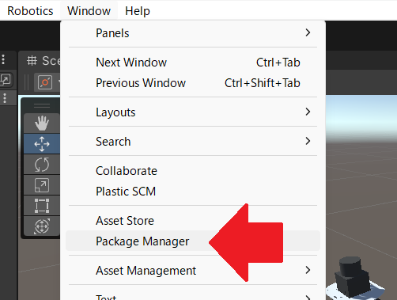

`Package Manager`を開いたら、`Unity Registry`を選択して、`Input System`をインストールします。

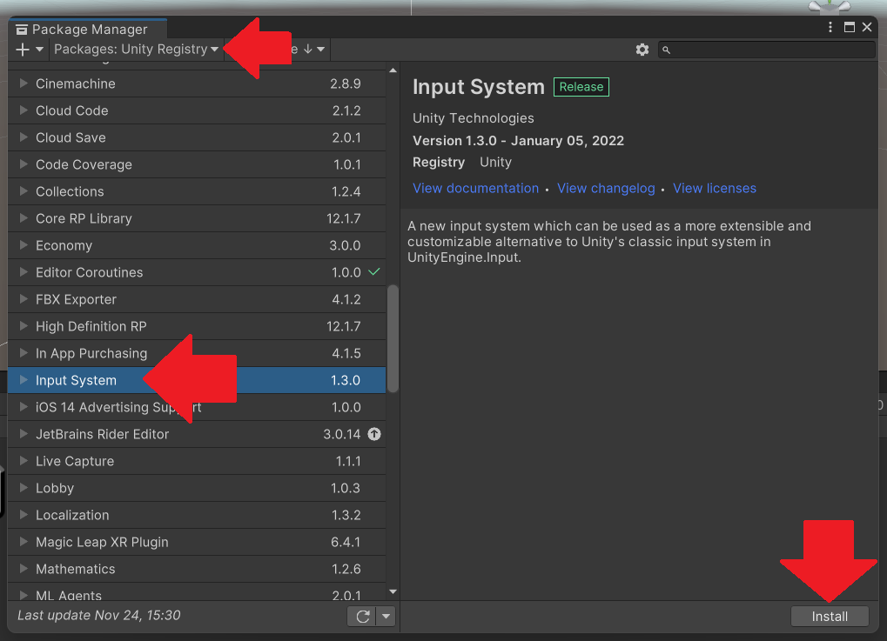

次に示すような警告が表示されたらYesを選択します。
すると自動的にUnityエディターが再起動されます。

### 2. On-Screen Stickの配置と設定

Input SystemのOn-Screen Stickを配置します。

前のステップで作成したロボット操作用ボタンの代わりにOn-Screen Stickを使用するため、
Hierarchyの`Canvas` -> `Panel`を選択し、
Inspectorでチェックを外して`Panel`を非表示にします。

Hierarchyの`Canvas`の子オブジェクトとして`Image`を作成します。

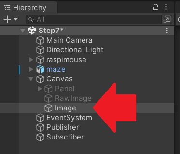

`Image`のInspectorでSource Imageに`Knob`を選択します。

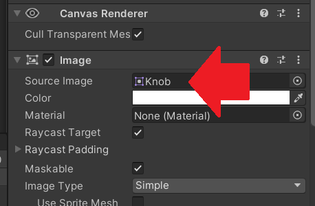

`Image`のInspectorで`Anchor Presets`を右下に設定し、
さらにPositionとWidthとHeightを以下のように設定します。

- Pos X : -200
- Pox Y : 200
- Pos Z : 0
- Width : 50
- Height : 50

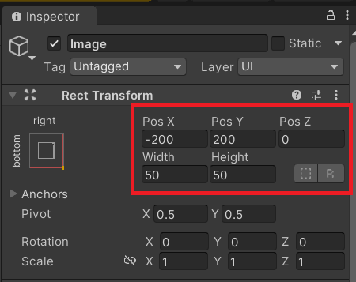

`Image`のInspectorで`Add Component`を押し、
`On-Screen Stick`を選択します。
さらに`On-Screen Stick`の`Control Path`に`Gamepad` -> `Left Stick`を選択します。

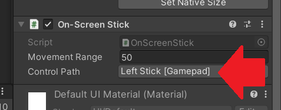

`EventSystem`のInspectorで`Standalone Input Module`の
`Replace with InputSystemUIInputModule`を押します。

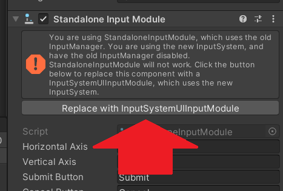

### 3. On-Screen Stick用のスクリプトを設定

Hierarchyの`Publisher`の`CmdVelPublisher`のチェックを外します。

さらに`Publisher`のAdd Componentを押して`OnScreenStickCmdVelPublisher`を追加します。

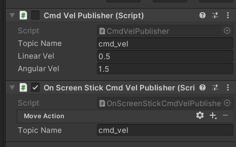

### 4. Input Actionの設定

Hierarchyの`Publisher`にアタッチしてある`OnScreenStickCmdVelPublisher`の`Move Action`の＋マークを押します。
そして`add Up\Down\Left\Right Composite`を選択します。

`2D Vector`をダブルクリックして、
`Composite Type`を`2D Vector`、
`Mode`を`Analog`に設定します。

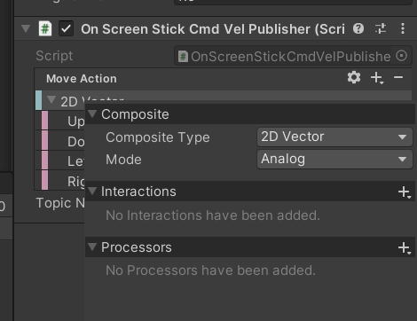

さらに、`Up`には`Gamepad` -> `Left Stick` -> `Up`を選択します。
`Down`と`Left`と`Right`も同じように設定します。

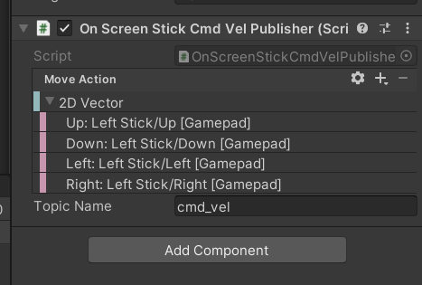

### 5. インターフェースの調整

On-Screen Stickのインターフェースを調整します。

Hierarchyの`Canvas`の子オブジェクトとして、`UI` -> `Image`を作成します。
名前は`WhiteCircle`とします。
また、画像で示すように`Image`の上に`WhiteCircle`を配置するようにしてください。

`WhiteCircle`のInspectorで、`Anchor Presets`を右下に設定します。
さらにPositionとWidthとHeightを以下のように設定します。

- Pos X : -200
- Pos Y : 200
- Pos Z : 0
- Width : 100
- Height : 100

また、画像で示すように`Source Image`に`Assets` -> `Resources` -> `white_circle`を設定してください。

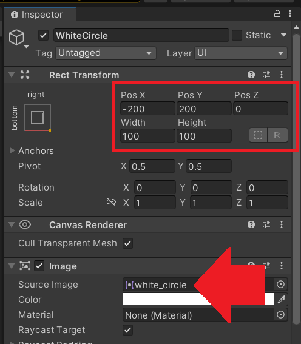

`Source Image`に`white_circle`が設定できない場合、
`white_circle`のInspectorで`Texture Type`が`Sprite (2D and UI)`になっているか確認してください。

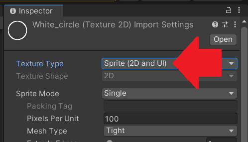

### 6. On-Screen StickでRaspberry Pi Mouseを操作

以上の作業を終えると、On-Screen StickでRaspberry Pi Mouseを操作できます。

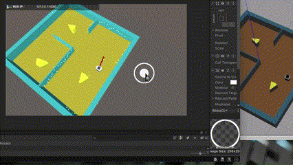
