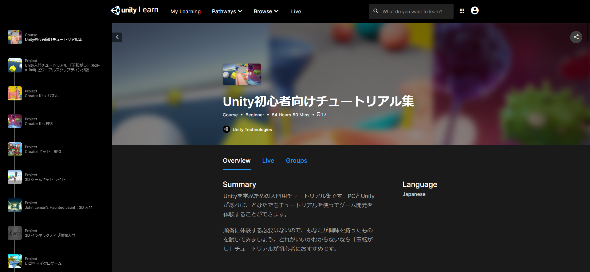

# Unityとロボットが連携してうれしいこと
## UI作成が簡単
キーボードやマウス、ゲームコントローラ、タッチパネルなどを用いたUIを簡単に作成することができます。本教材ではマウスでクリックできる仮想的な押しボタンを作成してRaspberry Pi Mouseを操作することができます。操作しやすいUIを作成するためには見た目も重要な要素となりますが、UnityにはUIの見た目をカスタマイズするための様々なツールや素材が備わっています。サンプルプログラムを一通り動作させた後にはぜひオリジナルのカスタマイズを加えてみてください。

## マルチプラットフォームサポート
様々なプラットフォーム上で動作するので作成したいUIに応じて適切な端末を選ぶことができます。例えばPCで動作するプロジェクトをスマートフォン向けにビルドすることが可能です。現実のロボットを操作する際は持ち運びしやすい端末から操作できるととても便利になります。またARやVR向けのプラグインも多く公開されているので空間を活用した直感的なUIを作成することもできるかもしれません。対応プラットフォームについて詳しくは[こちら](https://unity.com/ja/features/multiplatform)をご覧ください。

## リアルタイムレンダリング
HDRP(High Definition Render Pipeline)やURP(Universal Render Pipeline)といった機能が
代表するように高品質なグラフィックスをリアルタイムにレンダリングすることができます。
現実世界の状態をコンピュータ上で再現するデジタルツインといった分野では
より現実に近い見た目が求められる場合があります。
下記画像は左がデフォルトのBuilt-in、右がより高精細なHDRPを用いた画面です。
今回使用するロボットモデルはシンプルなので差異が少ないですが、
テクスチャやマテリアルといった質感に関わる要素を作りこむことによってよりリアリティのある表現をすることができます。

## 豊富な技術と素材
[公式チュートリアル](https://learn.unity.com/course/unity-tutorials-for-beginners-jp)や[マニュアル](https://docs.unity3d.com/ja/2020.3/Manual/UnityManual.html)、[Unity Asset Store](https://assetstore.unity.com/?locale=ja-JP)、個人のブログ記事などゲーム開発で培われた様々な技術や素材が蓄積されています。実際に本教材で扱う押しボタンの作成も既存のゲーム開発とまったく同じ手順です。素材は3Dモデルやテクスチャなど様々なフォーマットのものを読み込んで使用することができます。本教材ではロボットのモデルデータであるURDFやシミュレータ用のフィールドデータを読み込みます。今後開発を進めていく際にわからないことがあった場合は[Unity Forum](https://forum.unity.com/)上のコミュニティで情報交換することもできます。

---

* [目次](./intro2.md)
* [INTRO0](./intro0.md)
* [INTRO2](./intro2.md)