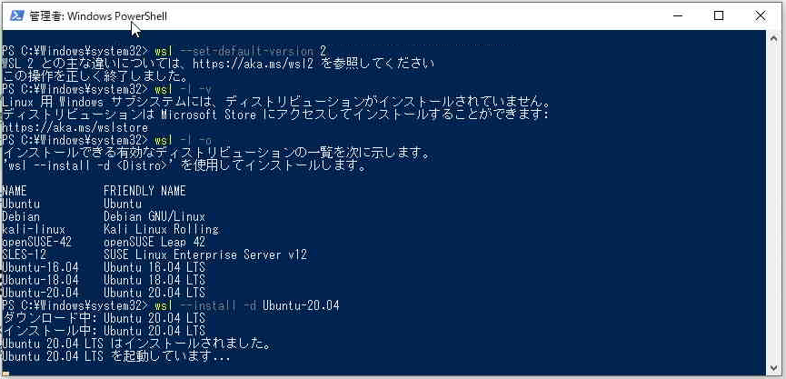
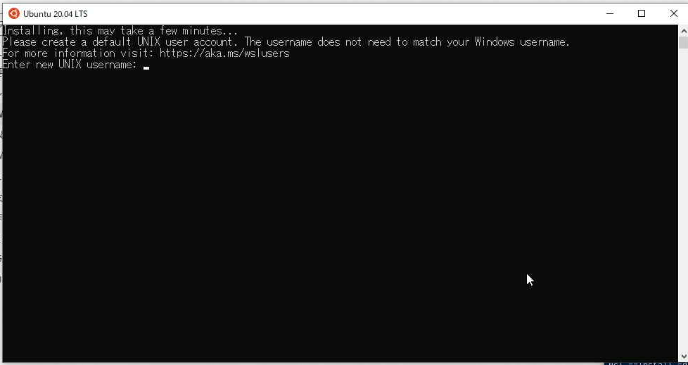
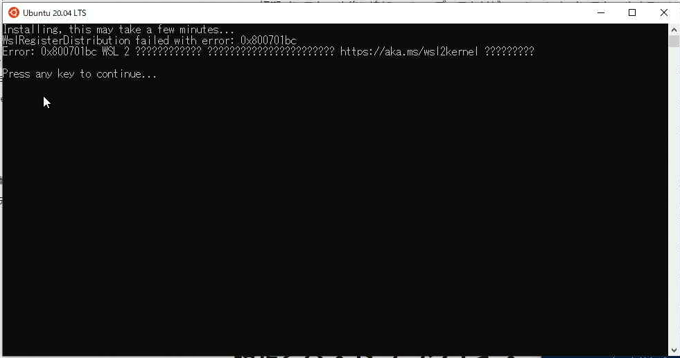
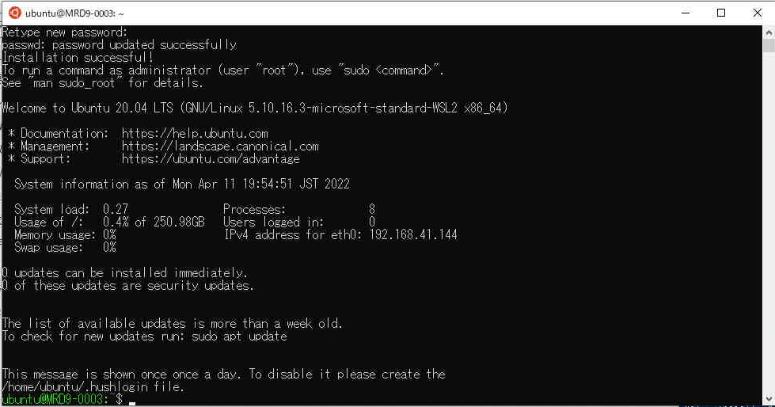
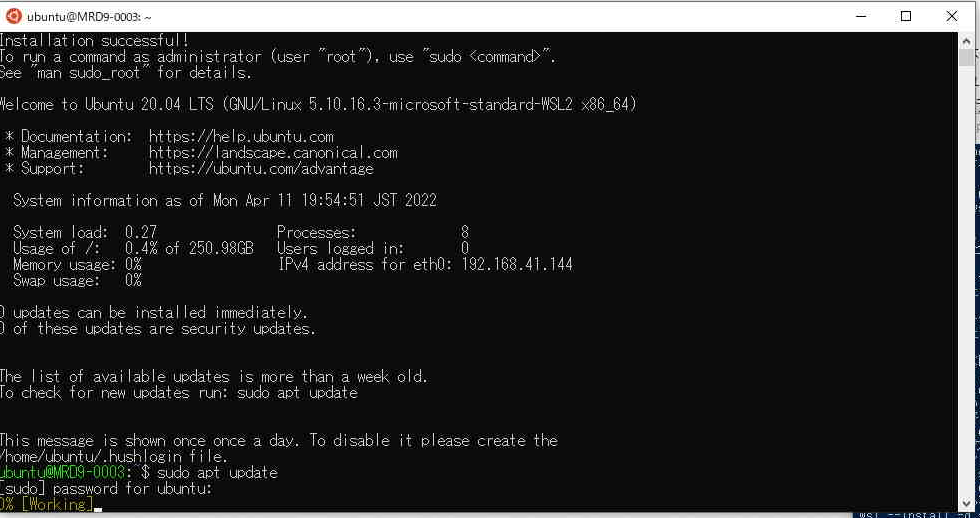
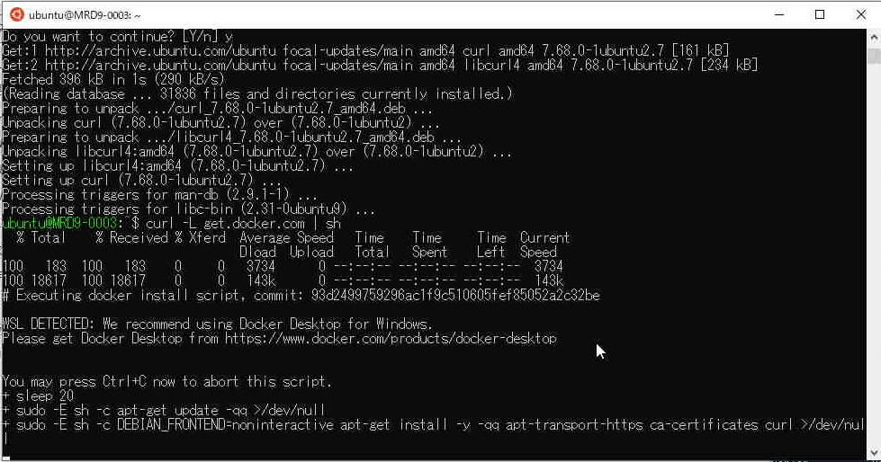
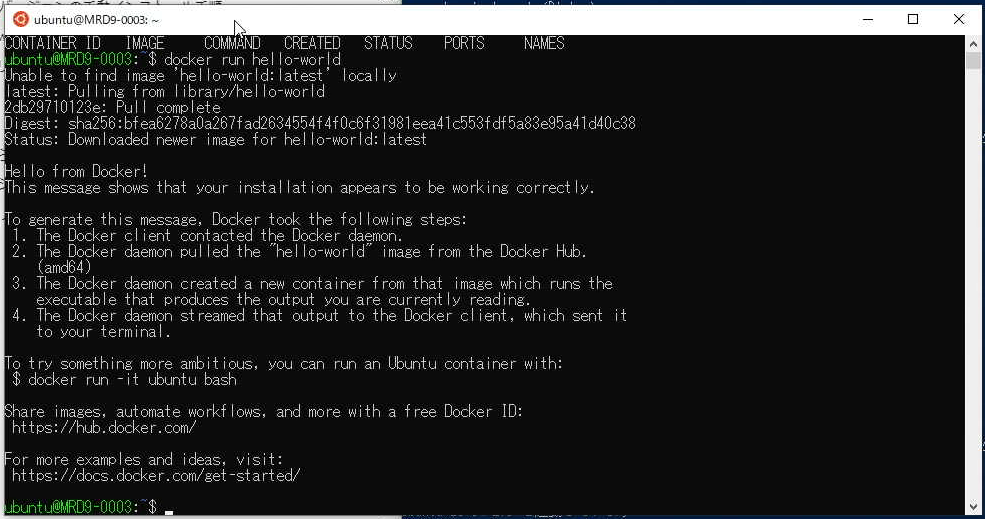

# Dockerのセットアップ

ここではDockerのインストール方法とDockerイメージの構築方法を説明します。
本編ではROSの環境をDockerを使って構築します。
一般的にはROSを手動でインストールすることもありますが、今回はDockerを使ってROSの環境構築についてはできる限り手順を省略しています。

## Dockerのインストール

ドキュメントを参考にしながらDockerをインストールします。
インストール手順は変わる可能性がありますので公式から案内される資料を参照してください。  
※ 2022年6月現在、WindowsでDockerを使用する際によく用いられる「Docker Desktop」は、 __一定の条件を満たしている場合を除いて有料__ です。詳しくは本資料の「参考情報」を参照してください。

* 公式ドキュメント（英語）
    * https://docs.docker.com/desktop/windows/install/
* 有志による非公式ドキュメント（日本語）
    * https://qiita.com/zaki-lknr/items/db99909ba1eb27803456


## 参考情報

### Docker Desktopの料金プランについて

WindowsでDockerを使用する際に必要なDocker Desktopは個人使用や教育使用などの一定の条件を満たしている場合を除き、2022年2月から有料化されています（2022年6月現在）。  
詳細については関連リンクをご参照ください。


#### 関連リンク

* Docker Subscription Service Agreement 
    * https://www.docker.com/legal/docker-subscription-service-agreement/

> Docker Desktopが有料化へ、ただし250人未満かつ年間売り上げ1000万ドル（約11億円）未満の組織や個人やオープンソースプロジェクトでは引き続き無料で利用可能
> https://www.publickey1.jp/blog/21/docker_desktop250100011.html

* 公式のお知らせ（英語）
    * https://www.docker.com/blog/updating-product-subscriptions/

> Docker Desktop for Linuxを開発中とDocker社が表明。有料化の発表が好評だったとして機能強化など加速
> https://www.publickey1.jp/blog/21/docker_desktop_for_linuxdocker.html

* 公式のお知らせ（英語）
    * https://www.docker.com/blog/accelerating-new-features-in-docker-desktop/

> 「Docker Desktop for Linux」が登場、WindowsやMac版と同じ機能や操作を提供、Raspberry Pi OSにも対応
> https://www.publickey1.jp/blog/22/docker_desktop_for_linuxwindowsmacraspberry_pi_os.html

* 公式のお知らせ（英語）
    * https://www.docker.com/blog/the-magic-of-docker-desktop-is-now-available-on-linux/

### WSL 2へのDockerのインストール

[Docker Engine](https://docs.docker.com/engine/install/)は2022年6月現在、有料化対象外です。Docker Desktopよりも機能は少ないですが、WindowsでDocker CLIをWSL 2にインストールしてDockerを使い、本教材の内容を試すこともできます。

#### WSL 2の設定

WSL 2のインストール方法についてはMicrosoftが公開する資料にまとまっています。

参考：https://docs.microsoft.com/ja-jp/windows/wsl/install

Windows 10のビルド 19041より前のバージョンでは「仮想マシンの機能の有効化」などの操作を手動で行う必要があります。

参考：https://docs.microsoft.com/ja-jp/windows/wsl/install-manual

ここではWindows 10のビルド 19041以降のバージョンの方法を紹介します。

PowerShellを管理者権限で開き、WSLを有効化します。

```
wsl --install
```

WSL 2をデフォルトバージョンに指定します。

```
wsl --set-default-version 2
```

Ubuntu 20.04を指定してインストールします。

```
wsl --install -d Ubuntu-20.04
```



正常にインストールが完了していればここで「Enter new UNIX username:」と表示されます。
WSL 2の中でのみ使用するユーザ名とパスワードなので忘れないように設定します。



もしここで以下の図のように`0x800701bc`のエラーが出た場合は「Linux カーネル更新プログラム パッケージ」をインストールしてください。

https://docs.microsoft.com/ja-jp/windows/wsl/install-manual#step-4---download-the-linux-kernel-update-package



WSL 2に無事ログインできると以下の画像のようにbashが起動します。



#### Dockerのインストール

Dockerをインストールするために必要なパッケージをインストールします。

```
sudo apt update
sudo apt install curl
curl -L get.docker.com | sh
sudo gpasswd -a $USER docker
```






Dockerインストール時の設定を反映させるため、Linux シェルのウインドウを一度閉じ、WSL 2を起動し直します。

Dockerのサービスを起動します。

```
sudo systemctl start docker
```

hello-worldを実行します。

```
docker run hello-world
```



以上でDockerのインストールと動作確認は完了です。

---

* [目次](./intro2.md)
* < [INTRO2](./intro2.md)
* \> [STEP0](./step0.md)