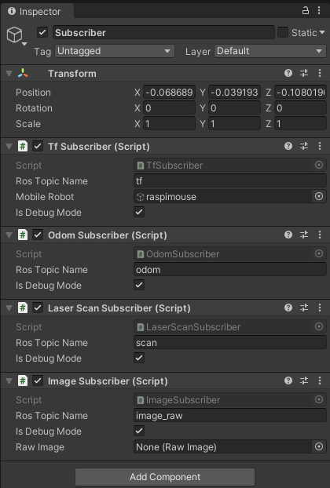
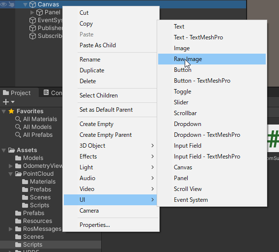
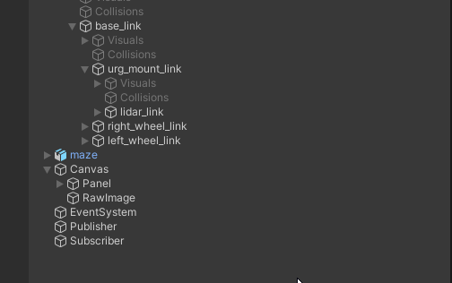
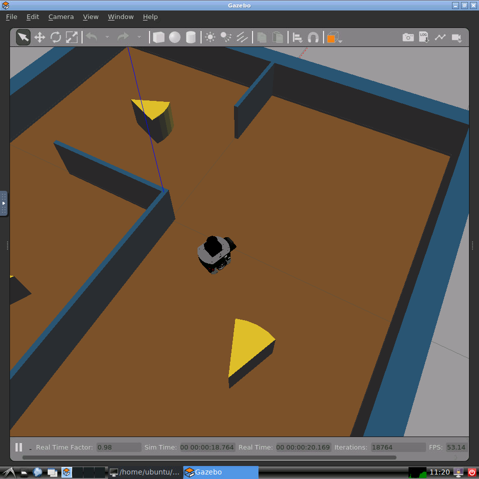

# カメラデータの可視化

## 概要


本ステップ実行後の状態のSceneファイルは[`MobileRobotUITutorialProject/Assets/Scenes/Step7.unity`](../MobileRobotUITutorialProject/Assets/Scenes/Step7.unity)から入手できます。

## 動作確認済環境

* Windows 10 Home バージョン 20H2
* Unity 2020.3.17f
* [Unity-Technologies/ROS-TCP-Connector](https://github.com/Unity-Technologies/ROS-TCP-Connector) v0.5.0
* Docker Desktop 3.6.0

## 手順

## 1. カメラデータ受信用スクリプトをアタッチ

[STEP6](./step6.md)までと同様に`Assets/Scripts/ImageSubscriber.cs`を`Subscriber`オブジェクトにアタッチします。

ここまでで`Subscriber`に追加したコンポーネントは`Tf Subscriber`、`Odom Subscriber`、`Laser Scan Subscriber`、`Image Subscriber`の4つになります。



## 2. カメラデータ描画用GameObjectの作成と描画設定

Hierarchyウィンドウの`Canvas`オブジェクトの子オブジェクトとして`RawImage`形式のGameObjectを`RawImage`という名前で作成します。





`RawImage`オブジェクトについてInspectorウィンドウから表示位置を変更します。
`Rect Transform`コンポーネントのAnchor Presetsは右下寄せになるright-bottomを選択します。
Pos X, Pos Y, Pos Z, Width, Heightはそれぞれ-110, 440, 0, 200, 200にします。


次に、`Subscriber`オブジェクトを選択してInspectorウィンドウを開き、`Image Subscriber`コンポーネントの`Raw Image`に先程作成した`RawImage`オブジェクトをを指定します。


### 3. Unityプロジェクトの実行

[STEP3](./step3.md)～[STEP6](./step6.md)と同様に、再生モードでUnityプロジェクトを実行します。

次にGazeboシミュレータを起動します。Dockerを起動し、LXTerminalを実行するところまではこれまでと同じですが、
シミュレータの起動時にオプションを指定します。

1枚目のLXTerminalで以下のコマンドを実行します。

```
roslaunch raspimouse_gazebo raspimouse_with_cheeze_maze.launch camera:=true
```

無事実行できると以下のようにシミュレータが起動します。[STEP6](./step6.md)までとは少し異なり、カメラがロボット前方にあることが確認できます。



2枚目のLXTerminalで以下のコマンドを実行します。

```
roslaunch ros_tcp_endpoint endpoint.launch
```

シミュレータを起動してros_tcp_endpointを起動したあとは再生モードのUnityの操作ボタンから移動指令を送信します。


オドメトリとLiDARデータに加えて、カメラデータを可視化することができました。

### 本STEPのまとめ

カメラデータ受信用スクリプトとカメラデータ描画用オブジェクトを追加し、カメラデータを可視化する方法を紹介しました。

# 終わりに

「UnityとROSで学ぶ移動ロボット入門 UI作成編」のチュートリアルは以上です。
本教材の内容を応用したオリジナル作品の作成や、
各種ツールのより高度なテクニックを学ぶ際は[INTRO1](./intro1.md)、
[INTRO2](./intro2.md)にてご紹介したリンク先をぜひ参考にしてみてください。

これから先、Raspberry Pi Mouse以外のロボットを試してみたり、Unity Asset Storeなどで公開されているアセットを組み合わせてカスタマイズしてオリジナルUIにチャレンジしたり、
みなさんがROS対応移動ロボットとUnityを組み合わせてUIを制作する際の一助となれば幸いです。

# 謝辞

本教材の開発の開発にあたり多大なるご協力をを頂いた株式会社アールティの皆様に深く感謝し、厚くお礼申し上げます。

---

* [目次](./intro2.md)
* < [STEP6](./step6.md)